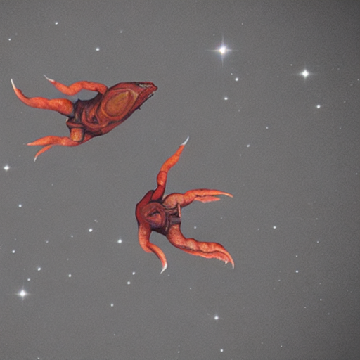

## Space App Toyohashi in Japan / 豊橋

### [Team X Alien (チーム星人)](https://2022.spaceappschallenge.org/challenges/2022-challenges/space-biology-superhero/teams/team-x-alien/project)

- Mr. Takeo (竹尾さん)
- Mr. Matsubara (松原さん)
- Me, Shimizu (清水(記))

### Choice Theme / 選択したテーマ

- [BUILD A SPACE BIOLOGY SUPERHERO](https://2022.spaceappschallenge.org/challenges/2022-challenges/space-biology-superhero/details)

### Explanation / 説明書き

- 簡単な火星の環境をシミュレートした遺伝的アルゴリズムにより導き出した究極生命体の特徴（=画像生成に与えるキーワード)を画像生成プログラムに与えて未来に生き残る究極生命体の画像を生成する。
- The image generation program is given the characteristics of the ultimate life form (= keywords for image generation) derived by a genetic algorithm that simulates a simple Martian environment to generate images of the ultimate life form that will survive in the future.

- [Slide (Sorry, Only Japanese) / スライド(日本語のみ)](https://docs.google.com/presentation/d/1Umq53JqME-GUJN6TgCDA7Fu1CcQhMJTG/edit#slide=id.g15d379b926a_3_0)

- [Movie in YouTube / 紹介動画 YouTube](https://www.youtube.com/watch?v=CmSESCkDMz4)

### Output Images by Image Generation / 画像生成により出力した画像

##### left: first Generation! Very Furry Tall Herd of No teeth Lighter skin Ferocious alien from Mars  
##### center: 500th Generation! Pair Carnivorous  Gentle alien from Mars  
##### right: 1000th Generation! Pair Herbivorous  Ferocious alien from Mars   

&nbsp;&nbsp;&nbsp;&nbsp;&nbsp;
&nbsp;&nbsp;&nbsp;&nbsp;&nbsp;&nbsp;&nbsp;&nbsp;&nbsp;&nbsp;

### How to Execute / 実行方法

- On Colab
  - Open [StableDiffusionSample.ipynb on Colab](https://colab.research.google.com/drive/1Uaqmq3ibMmEwepnn4OWHf2TVboUVa14O?usp=sharing)
  - Upload simulation.py to the current directory of Colab

- On Local
  - Install requirements.txt library in a virtual environment, etc.
  - Launch notebook StableDiffusionByCpu.ipynb.

- Common
  - Create a Hugging Face account.
  - Create an access token in Hugging Face Setting.
  - Allow the use of the model you want to use (e.g. CompVis/stable-diffusion-v1-4), referring to the explanation on the official site.
  - Run a Colab or Local notebook, enter the Hugging Face token into the notebook, login and run the notebook.

- グーグルコラボ
  - [StableDiffusionSample.ipynb on Colab](https://colab.research.google.com/drive/1Uaqmq3ibMmEwepnn4OWHf2TVboUVa14O?usp=sharing)を開く
  - Colab のカレントディレクトリに simulation.py をアップロードする

- ローカル環境
  - 仮想環境などに requirements.txt のライブラリをインストールする
  - StableDiffusionByCpu を立ち上げるする。

- 共通
  - [Hugging Face](https://huggingface.co/)のアカウントを作成する
  - [Hugging Face の Setting](https://huggingface.co/settings/tokens)でアクセストークンを作成する
  - [公式サイトの解説](https://huggingface.co/docs/hub/security-tokens)を参考に、使用するモデル(例: CompVis/stable-diffusion-v1-4)の使用を許可する
  - Colab または Local のノートブックを実行し、Hugging Face のトークンをノートブックに入力しログインしてノートブックを実行する。

### File Organization / ファイル構成

- StableDiffusionByCpu.ipynb
  - An executable file that performs image generation. Sory You Need to Login Hugging Face Infomation!
  - 画像生成を行う実行ファイル。Hugging Face へのログイン情報が必要。
- simulation.py 
  - A file with a genetic algorithm simulation running in StableDiffusionSample.ipynb
  - StableDiffusionSample.ipynb で実行する、遺伝的アルゴリズムによるシミュレーションを行っているファイル。
- sample_output_images
  - Folder containing the Output image described above.
  - 上述のOutput画像が入ったフォルダ